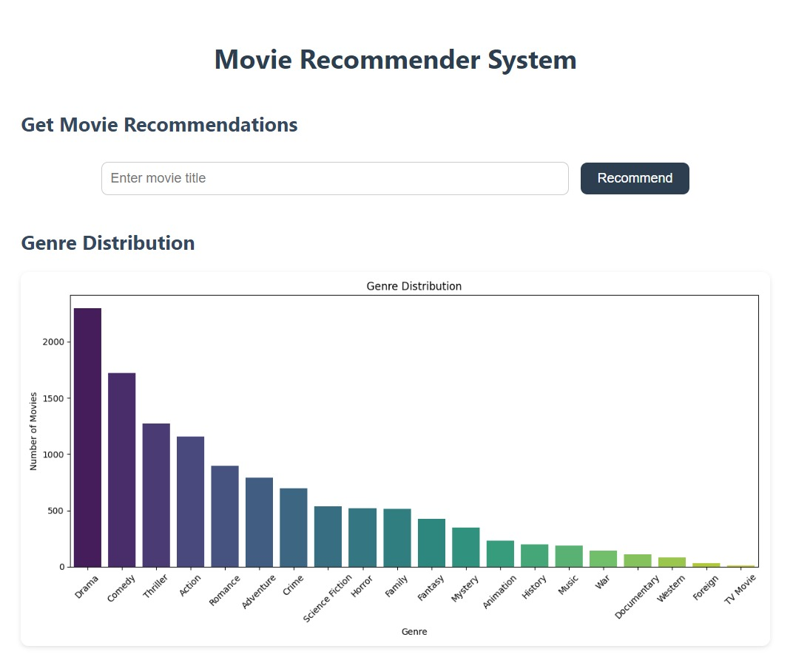
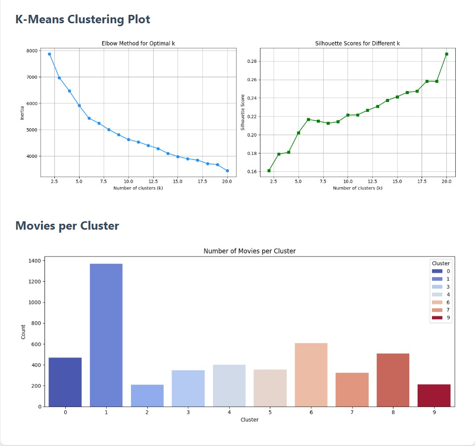
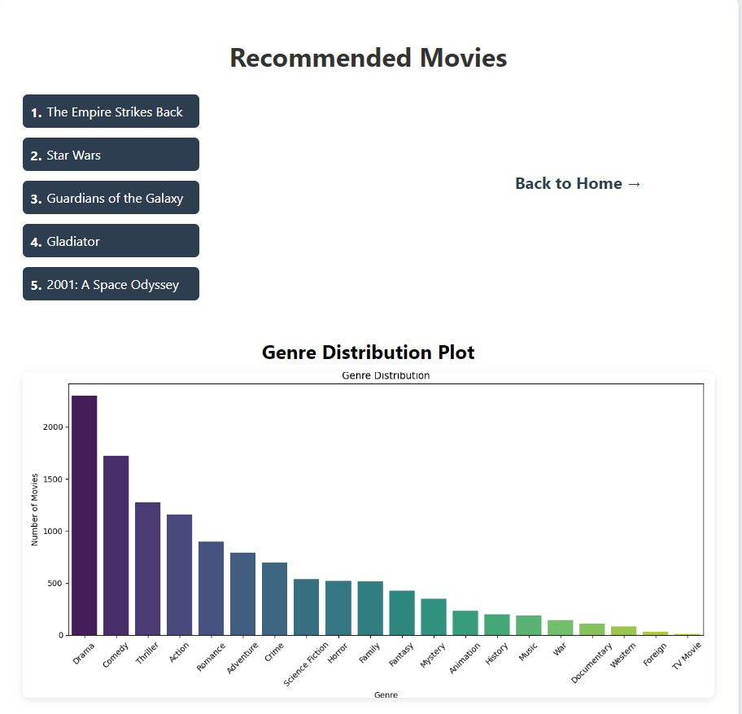
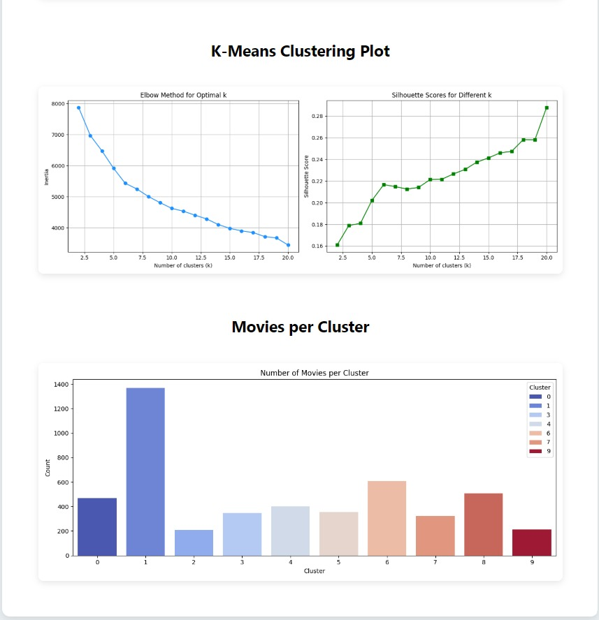

#  Movie Recommender System using K-Means Clustering

##  Introduction
In today's digital world, choosing a movie from thousands of options can be overwhelming. This **Movie Recommender System** helps users by suggesting movies based on genre, vote average, and popularity using the **K-Means Clustering** algorithm. By analyzing movie metadata, the system groups similar movies together and recommends them to the user based on their preferences.


## 📸 Screenshots

### Homepage  
  


### Recommendations Page  
  


### Genre Distribution Plot  


##  Developed By
Tanisha Kushwah
BCA, Department of Computer Science
Email: tanisha206guttu@gmail.com

##  Technologies Used
. Python
. Flask (for web interface)
. Pandas, NumPy (for data manipulation)
. Scikit-learn (for machine learning & clustering)
. Matplotlib, Seaborn (for data visualization)

##  Dataset Used
. tmdb_5000_movies.csv
. tmdb_5000_credits.csv

These datasets contain movie metadata including genres, vote averages, and popularity from TMDB.

Download it here:
🔗 Kaggle Dataset Link: https://www.kaggle.com/datasets/tmdb/tmdb-movie-metadata

## Features
- **Movie Recommendations**: Suggests movies based on user preferences (genre, vote average, popularity).
- **Clustering**: Groups movies into clusters using the K-Means algorithm to suggest similar movies.
- **Data Visualizations**: Displays genre distribution, K-Means clustering results, and cluster counts.


## How to Run

```bash
# Step 1: Clone the repository
git clone https://github.com/your-username/movie-recommender.git
cd movie-recommender

# Step 2: Install required libraries
pip install -r requirements.txt

# Step 3: Run the Flask app
python app.py
